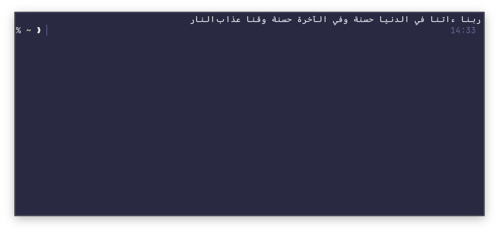

# Dua of the Day

Tiny shell utility to start the terminal session with a small dua (prayer).

Expects a `.prayers` file in the home directory, where each line is a little dua. Then it just needs to be installed with `cargo install` and added to `.zshrc`.

Different terminals have different ways they fuck up Arabic text. Ghostty reverses the whole string and shows it backwards. Zed terminal shows every singular word correctly but the string is reversed. Terminal.app works fine.

For Ghostty, use `--rev`. For Zed Terminal, use `--rev-words`. If your terminal mucks Arabic text in a different way from these two please submit a PR.

## Example

### `.prayers` file

```
اللهم إني أعوذ بك من الهم والحزن، والعجز والكسل
سبحان الله وبحمده سبحان الله العظيم
اللهم إني أسألك الهدى والتقى والعفاف والغنى
اللهم أعني على ذكرك وشكرك وحسن عبادتك
رب اشرح لي صدري ويسر لي أمري واحلل عقدة من لساني
لا إله إلا أنت سبحانك إني كنت من الظالمين
ربنا ءاتنا في الدنيا حسنة وفي الآخرة حسنة وقنا عذاب النار
اللهم إنك عفو تحب العفو فاعف عنا
الحمدلله عدد خلقه وزنة عرشه ومداد كلماته
خير الناس من ينفع الناس
```

### Ghostty


